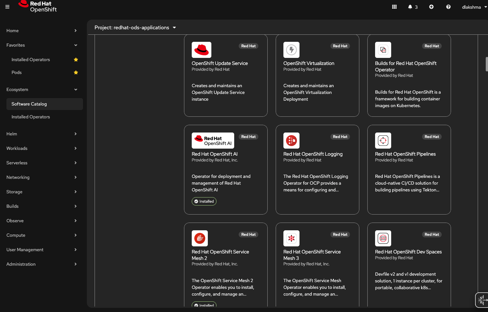

# Installing OpenShift AI and TrustyAI
This guide will walk through installing OpenShift AI 3.X and TrustyAI into your cluster. Starting from a completely
blank cluster, you will be left with:
1) An OpenShift AI 3.X installation
2) A namespace to deploy models into
3) A TrustyAI Operator, to manage all instances of the TrustyAI Service
4) A TrustyAI Service, to monitor and analyze all the models deployed into your model namespace.

## Cluster Setup
1) Make sure you are `oc login`'d to your OpenShift cluster
2) Create two projects. These names are arbitrary, but I'll be using them throughout the rest of this demo:
   1) `oc new-project model-bias`
   2) `oc new-project model-drift`
  
## If you plan on using Modelmesh (skip otherwise):
1) Prepare the `model-bias` or `model-drift` for OpenShift AI's model serving: `oc label namespace model-bias "modelmesh-enabled=true" --overwrite=true`

`oc label namespace model-drift "modelmesh-enabled=true" --overwrite=true`

## Enable User-Workload-Monitoring
To get enable OpenShift AI's monitoring stack, user-workload-monitoring must be configured:
1) Enable user-workload-monitoring: `oc apply -f resources/enable_uwm.yaml`
2) Configure user-workload-monitoring to hold metric data for 15 days: `oc apply -f resources/uwm_configmap.yaml`

Depending on how your cluster was created, you may need to enable a User Workload Monitoring setting from 
your cluster management UI (for example, on console.redhat.com)

## Install OpenShift AI Operator
1) From the OpenShift Console, navigate to "Operators" -> "OperatorHub", and search for "Red Hat OpenShift AI"
   
2) Click on "Red Hat OpenShift AI". 
   1) Hit "Install". 
3) From the "Install Operator" screen:
   1) Make sure "All namespaces on the cluster" in selected as the "Installation Mode":
   2) Hit install
4) Wait for the Operator to finish installing


## OpenShift AI 3.X
Use the following steps for OpenShift AI 3.X:

### OpenShift AI Prerequisties
1) Install the Authorino Operator. At the time of writing, Authorino 0.11.1 is verified to be compatible.
2) Install the Red Hat OpenShift Serverless operator.
3) Install the Red Hat OpenShift Service Mesh operator.

### Install OpenShift AI 3.X
1) Navigate to your `redhat-ods-operator` project
2) From "Installed Operators", select "Red Hat OpenShift AI".
3) Navigate to the "DSC Initialization" tab and hit "Create DSCInitialization", then install the default DSCI. Once the DSCI reports "Ready", move on to step 4. 
4) Navigate to the "Data Science Cluster" tab and hit "Create DataScienceCluster"
5) In the YAML view Make sure `trustyai` is set to `Managed`:

6) Hit the "Create" button
7) Within the "Pods" menu, you should begin to see various OpenShift AI components being created, including the `trustyai-service-operator-controller-manager-xxx`


## TLS Configuration for TrustyAI

To ensure TrustyAI can securely receive encrypted model payloads, you need to inject TrustyAI's CA bundle into your model controller configuration.

Follow these steps for *Red Hat OpenShift AI* (RHOAI):

**1. Set your namespace:**
```sh
NAMESPACE=redhat-ods-applications
```

**2. Allow manual management of the InferenceService config:**
```sh
oc patch configmap inferenceservice-config -n $NAMESPACE --type merge -p '{"metadata": {"annotations": {"opendatahub.io/managed": "false"}}}'
```

**3. Capture the logger image currently in use:**
```sh
IMAGE=$(oc get configmap inferenceservice-config -n $NAMESPACE -o json | jq -r '.data.agent | fromjson | .image')
```

**4. Patch the `inferenceservice-config` ConfigMap to add the TrustyAI CA bundle for the logger:**
```sh
oc patch configmap inferenceservice-config \
    -n "$NAMESPACE" \
    --type json \
    -p="[{
      \"op\": \"add\",
      \"path\": \"/data/logger\",
      \"value\": \"{\\\"image\\\" : \\\"$IMAGE\\\",\\\"memoryRequest\\\": \\\"100Mi\\\",\\\"memoryLimit\\\": \\\"1Gi\\\",\\\"cpuRequest\\\": \\\"100m\\\",\\\"cpuLimit\\\": \\\"1\\\",\\\"defaultUrl\\\": \\\"http://default-broker\\\",\\\"caBundle\\\": \\\"kserve-logger-ca-bundle\\\",\\\"caCertFile\\\": \\\"service-ca.crt\\\",\\\"tlsSkipVerify\\\": false}\"
    }]"
```

This will ensure that the deployed model controller will use the injected Trusted CA bundle, enabling encrypted (TLS) logging for TrustyAI integration.

> **Note:**  
> * Be sure that `resources/kserve-logger-ca-bundle.yaml` has been applied to your cluster.  
> * If you are not using RHOAI's example operator, consult your model controller's documentation for appropriate TLS CA injection steps.


### Install TrustyAI (OpenShift AI 3.X)
1) Navigate to your `model-bias` project or `model-drift` project: `oc project model-bias` or `oc project model-drift`
2) Run `oc apply -f resources/trustyai_crd.yaml`to both the projects if you plan to demo both the features. This will install the TrustyAI Service into your `model-bias` and `model-drift` projects, which will then provide TrustyAI features to all subsequent models deployed into that project, such as explainability, fairness monitoring, and data drift monitoring. 
